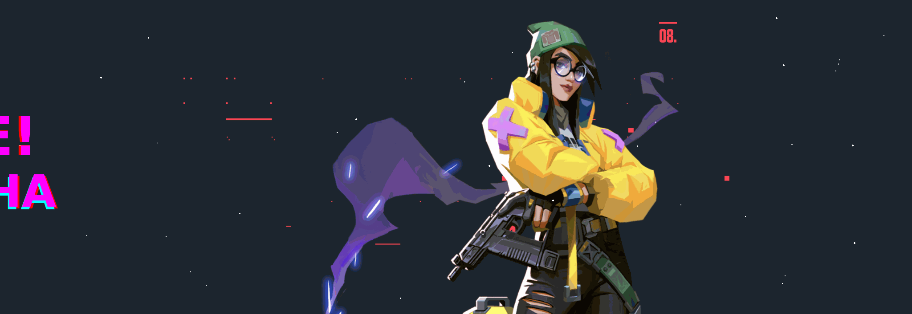

# 👩‍💻 Sobre mí

¡Hola! Soy **Natasha Muriel Cruz** 👋  
Actualmente estoy dando mis primeros pasos en el mundo del desarrollo web y construyendo mi camino como desarrolladora.

---

## 🚀 Formación

Estoy aprendiendo desarrollo **Full Stack Java** en:

🎓 **Bootcamp de desarrollo web en Generation**

Durante este proceso estoy adquiriendo conocimientos en:
- Frontend (HTML, CSS, JavaScript)
- Backend con Java
- Bases de datos
- Trabajo en equipo y metodologías ágiles

---

## 🎯 Mi Meta

Convertirme en un desarrollador capaz de:
- Construir proyectos útiles  
- Diseñar soluciones bien estructuradas  
- Generar impacto real en las personas  

---

## 💡 Frase personal

> *"Si corre, no toques nada"* 😄

---

## 🌱 En constante aprendizaje

Me encuentro mejorando mis habilidades día a día, explorando nuevas tecnologías y enfrentando desafíos que me ayuden a crecer en este camino 🚀

<!--
**2197natashacruz-droid/2197natashacruz-droid** is a ✨ _special_ ✨ repository because its `README.md` (this file) appears on your GitHub profile.

Here are some ideas to get you started:

- 🔭 I’m currently working on ...
- 🌱 I’m currently learning ...
- 👯 I’m looking to collaborate on ...
- 🤔 I’m looking for help with ...
- 💬 Ask me about ...
- 📫 How to reach me: ...
- 😄 Pronouns: ...
- ⚡ Fun fact: ...
-->
